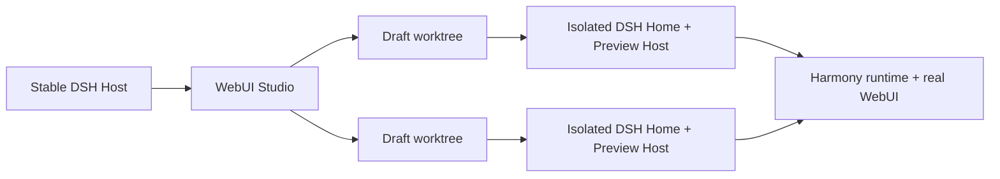

<div align="center">
  <a href="https://github.com/CH4ACKO3/dsh-harmony">
    
  </a>

  <h1>DeepSeek WebUI Studio</h1>

  <p>
    <strong>A visual-first studio for building DSH WebUI plugins.</strong>
    <br />
    Inspect the real interface, edit source, run builds, and validate patches without loading unfinished code into your stable DSH Host.
    <br />
    Powered by <a href="https://github.com/CH4ACKO3/dsh-harmony"><strong>dsh-harmony</strong></a>.
  </p>

  <p>
    <a href="#getting-started"><strong>Get started</strong></a>
    ·
    <a href="https://github.com/CH4ACKO3/dsh-webui-studio/issues">Report a bug</a>
    ·
    <a href="https://github.com/CH4ACKO3/dsh-webui-studio/issues">Request a feature</a>
  </p>

  [](LICENSE)
  [](package.json)
  [](https://github.com/CH4ACKO3/dsh-webui-studio/stargazers)
  [](https://github.com/CH4ACKO3/dsh-harmony)

  [简体中文](README.zh-CN.md) / [English](README.md)
</div>

## A visual workspace for the real DSH WebUI

WebUI Studio is not a mock page builder. It runs against the official DSH WebUI
and its real plugin graph, then turns visual inspection and source edits into
distributable plugin-owned artifacts.

Studio is an independent downstream application of
[`dsh-harmony`](https://github.com/CH4ACKO3/dsh-harmony). It uses Harmony's
public Host extension, runtime, Patch engine, and Draft APIs together with the
generic React registration API from
[`dsh-harmony-react`](https://github.com/CH4ACKO3/dsh-harmony/tree/main/packages/react).
The dependency direction stays one-way: Studio depends on Harmony; Harmony does
not depend on Studio.

## What you can do

- [x] Create a minimal DSH Web Client plugin or open an existing Git repository
- [x] Give every Draft its own Git worktree, `DSH_HOME`, profile, dependencies, and child Host
- [x] Preview the official WebUI without loading Draft code into the stable Host
- [x] Browse normally or inspect DOM, React owners, source candidates, and Patch traces
- [x] Edit Draft source with CodeMirror and protect installed dependency sources as read-only
- [x] Build, apply through Harmony, reload, and confirm the live Client graph revision
- [x] Run Draft-scoped DSH Agents with explicit Studio tools
- [x] Check package exports, artifacts, Patch state, ordering, dependencies, and pack output
- [x] Run multiple isolated Draft Preview Hosts at the same time
- [ ] Configure custom Draft profiles in the UI

## How it works



The stable Host owns the Studio interface, Draft registry, and Agent sessions.
Each Draft owns an isolated worktree and child Preview Host. A build becomes
active only after the Preview confirms the new live Client graph revision.
Stopping a Draft terminates its child Host but preserves its files and state.

Studio is served locally at:

```text
http://127.0.0.1:<dsh-port>/studio
```

Its managed data lives under `$DSH_HOME/studio/`:

```text
studio/
├── drafts/<draft-id>.json
├── repositories/<draft-id>/
├── worktrees/<draft-id>/
└── runtimes/<draft-id>/dsh-home/profiles/web/
```

## Getting started

> [!IMPORTANT]
> Studio requires the public Harmony extension and Draft APIs documented in
> [`docs/harmony-api-requirements.md`](docs/harmony-api-requirements.md).
> The currently published `dsh-harmony@0.1.2` predates those APIs.

```sh
git clone https://github.com/CH4ACKO3/dsh-webui-studio.git
cd dsh-webui-studio
npm install
npm run check

dsh plugin --profile web add link:$(pwd)
dsh web
```

Open the Studio URL printed by the local `dsh web` process, create or import a
Draft, and start its Preview Host.

A Draft package must:

- declare `dsh.client.platform: "web"`;
- export `.`, `./client`, and `./package.json`;
- define a non-empty `scripts.build` command.

## Development

| Command | Purpose |
| --- | --- |
| `npm run typecheck` | Check the Host, browser app, and Preview bridge |
| `npm test` | Run the unit and component test suite |
| `npm run build` | Build the Host, Studio UI, and Preview bridge |
| `npm run check` | Run typecheck, tests, and the complete build |
| `npm run test:integration` | Exercise Host, Draft, Preview, build, activation, and shutdown end to end |

The integration test requires a Harmony build that exposes the APIs described
in the compatibility note above.

## Design boundaries

- The official WebUI keeps its own-origin `/api` and WebSockets; Studio does not proxy them.
- The Preview bridge requires the exact parent origin and a per-start capability.
- Preview DOM, React, source, Patch, and comment data is treated as untrusted evidence.
- Source writes stay inside the selected Draft package and never follow symbolic links outside it.
- Registered element boundaries and Patch traces are candidate evidence, not claims of exact DOM ownership.

## Related projects

- [`dsh-harmony`](https://github.com/CH4ACKO3/dsh-harmony) - runtime patching, Host extension mounting, Draft lifecycle, and Patch inspection
- [`dsh-harmony-react`](https://github.com/CH4ACKO3/dsh-harmony/tree/main/packages/react) - React-aware Patch factories and Studio element/variable registration

## License

Distributed under the [MIT License](LICENSE).
